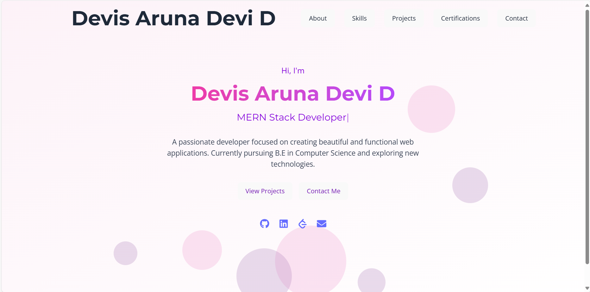
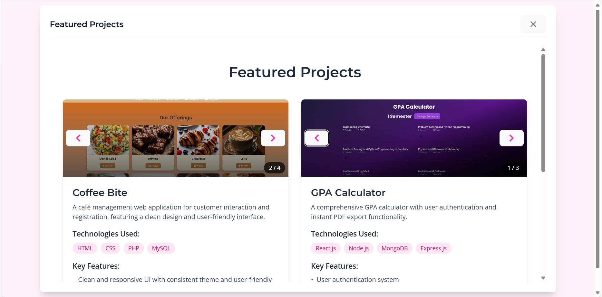
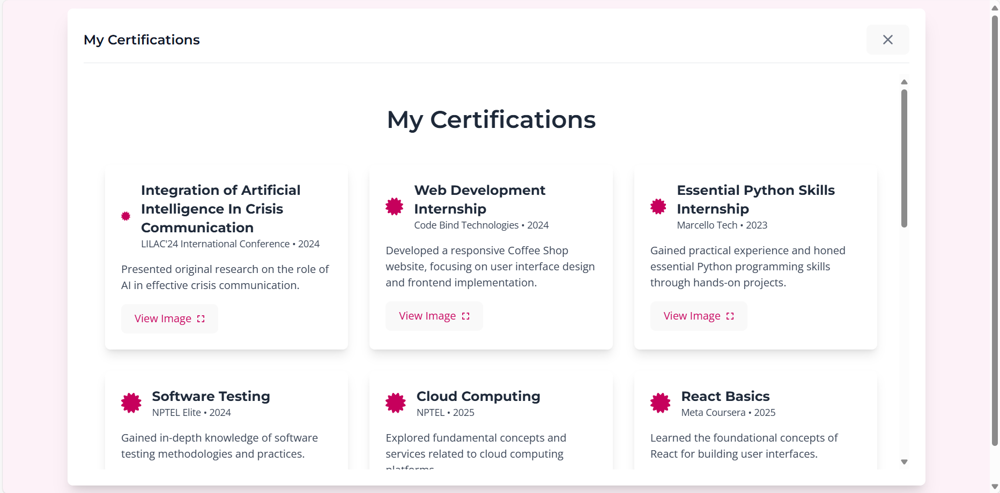
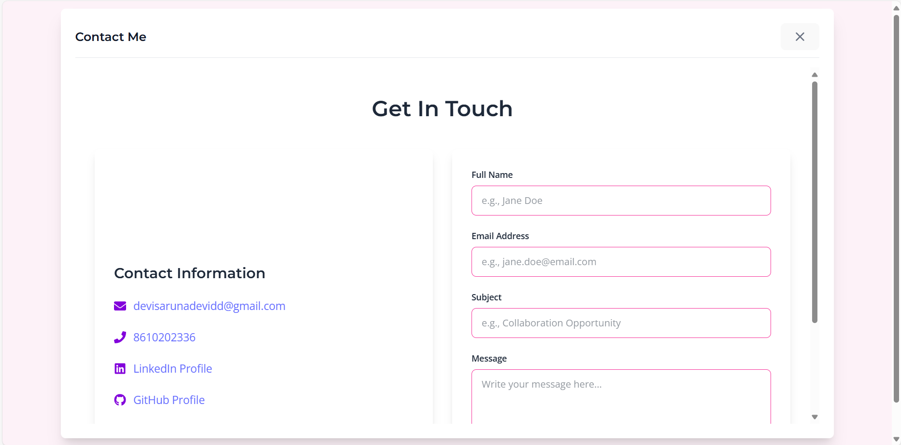

# 👩‍💻 Personal Portfolio - Devis Aruna Devi D

## 📌 Overview

Welcome to my **Personal Portfolio** built with **React** and **Tailwind CSS**!  
This website showcases my skills, projects, certifications, and achievements in **Full Stack Development**. It reflects my passion for creating impactful web solutions and my journey as a computer science student at Velammal College of Engineering and Technology.

---

🌐 **Live Website:**  
🚀 [Visit Portfolio Live](https://portfolio-wheat-three-19.vercel.app/)

---

## 🎯 Features

- 🏠 **Hero Section:** Engaging introduction with call-to-action
- 👤 **About Me:** Professional background, education, and career objectives
- 💼 **Projects Showcase:** Interactive display of key projects with live demos
- 🛠️ **Skills Section:** Technical skills and tools proficiency
- 📜 **Certifications:** Professional certifications and achievements
- 🎓 **Education:** Academic timeline and achievements
- 📬 **Contact:** Professional contact form with email integration
- 📱 **Responsive Design:** Optimized for all devices and screen sizes
- ⚡ **Performance:** Fast loading with modern web technologies

---

## 🖥️ Tech Stack

- ⚛️ **Frontend:** React + Vite
- 🎨 **Styling:** Tailwind CSS
- 🛠️ **Other Tools:** Framer Motion, React Icons

---

## 🖼️ Screenshots

### 📌 Home Page

_Professional introduction with engaging hero content._  

### 📌 Projects Showcase

_Interactive project gallery with detailed descriptions._  

### 📌 Skills & Certifications

_Technical skills and professional certifications._  

### 📌 Contact Section

_Professional contact form for easy communication._  

---

## 🎯 Key Projects Featured

- **GPA Calculator** - Academic grade management system
- **Coffee Shop Website** - E-commerce platform

---

## 🚀 Future Enhancements

- 📝 **Blog Section** - Technical articles and insights
- 🌐 **Multi-language Support** - International accessibility
- 📱 **PWA Features** - Progressive Web App capabilities
- 🌙 **Dark/Light Mode** - Theme customization
- 📊 **Analytics Integration** - Visitor insights
- 🔍 **SEO Optimization** - Better search engine visibility

---

## 📬 Contact & Connect

- 📧 **Email:** [devisarunadevidd@gmail.com](mailto:devisarunadevidd@gmail.com)
- 🔗 **GitHub:** [https://github.com/devisarunadevid](https://github.com/devisarunadevid)

---

✨ _Built with ❤️ by Devis Aruna Devi D_  
🎓 _Computer Science Student | Full Stack Developer_
